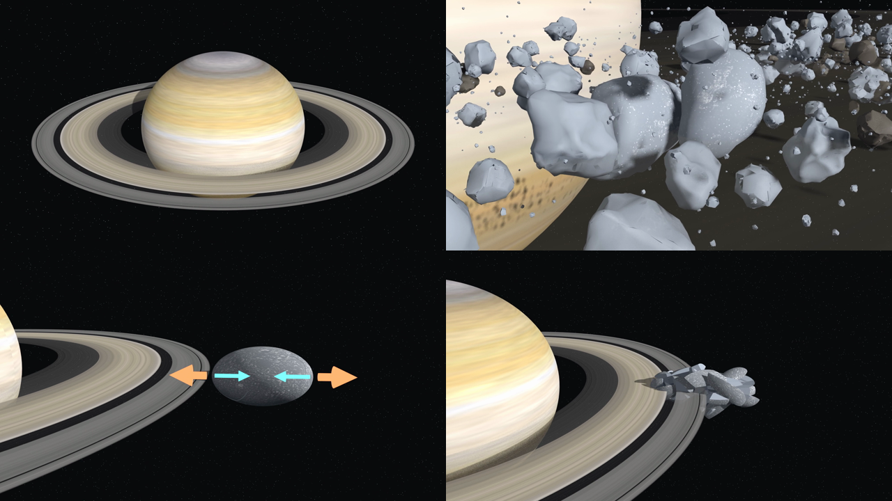
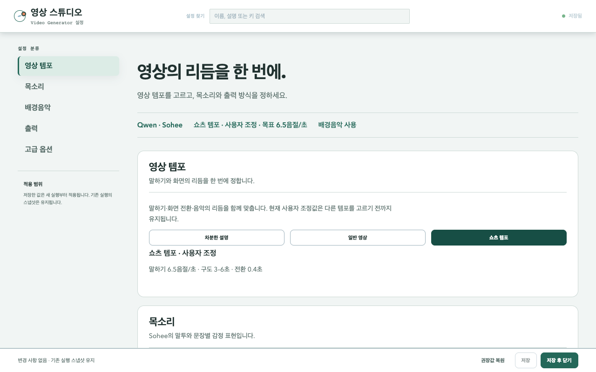
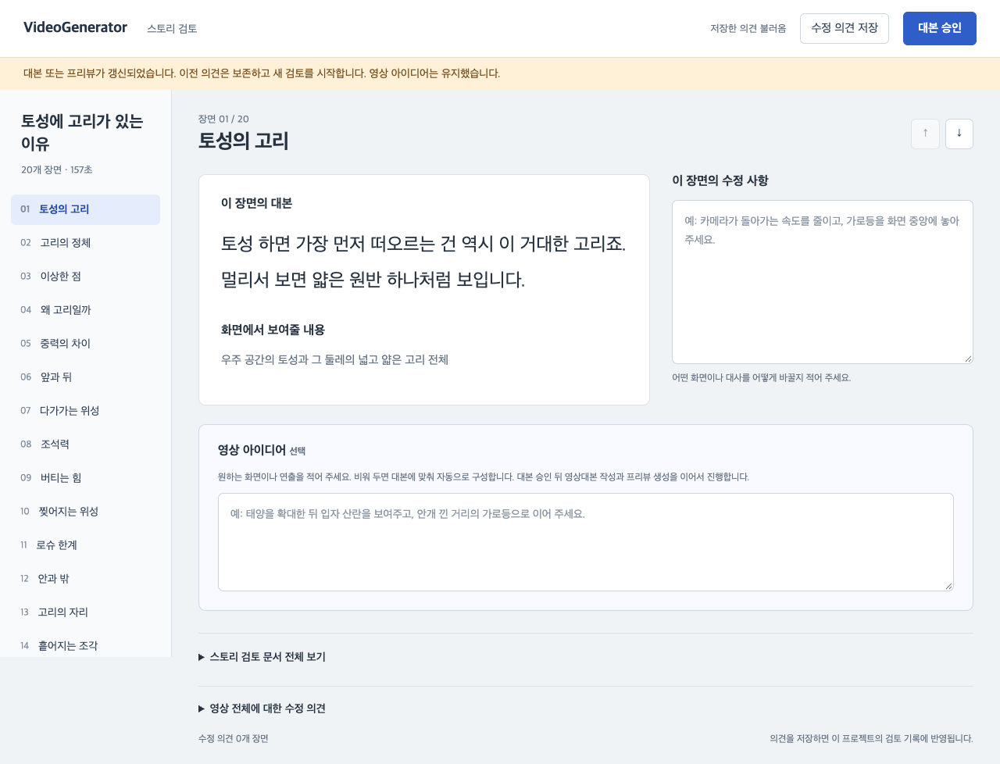
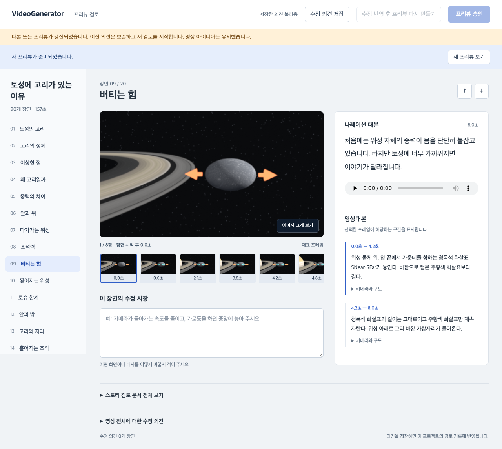

# Video Generator

[English](README.md) · **한국어** · [日本語](README.ja.md) · [简体中文](README.zh-CN.md) · [Español](README.es.md)

주제 하나를 주면 AI 에이전트가 조사하고, 대본을 쓰고, 목소리를 입히고, 3D 화면까지 만들어 설명 영상 한 편을 완성하는 작업 폴더입니다.

사람이 하는 일은 **고르고, 읽어 보고, 고칠 곳을 적고, 승인하는 것**뿐입니다. 코드를 직접 쓰거나 명령어를 외울 필요는 없습니다. 중요한 단계마다 웹 화면이 열리고, 거기서 버튼을 누르거나 의견을 적으면 됩니다.



*이 폴더로 만든 "토성에 고리가 있는 이유"(2분 38초)의 장면들입니다.*

<sub>그림에 쓰인 3D 모델(수정하여 사용): ["Saturn"](https://sketchfab.com/3d-models/saturn-c09a1970148c43ad99db134a9d6d00b5) by Nestaeric, ["Asteroids Pack (rocky version)"](https://sketchfab.com/3d-models/asteroids-pack-rocky-version-adde1ecf129e4509be8af61b84bafa85) by SebastianSosnowski, ["Wandering Asteroids Of Andromeda"](https://sketchfab.com/3d-models/wandering-asteroids-of-andromeda-6a8e84e0fdea43628b8b3ab85b130281) by ARCTIC WOLVES™, ["Asteroid low poly"](https://sketchfab.com/3d-models/asteroid-low-poly-9a43ef48a70647188576ccb5987b7e64) by pasquill. 모두 [CC BY 4.0](https://creativecommons.org/licenses/by/4.0/).</sub>

## 무엇을 만들어 주나요

- 1~3분 길이의 한국어 설명 영상 (가로·세로·정사각형 중 선택)
- 한국어 나레이션과 배경음악
- 영어·일본어·중국어·스페인어 음성과 자막 (원하는 언어만 선택)

화면은 생성형 영상이 아니라 Blender로 계산해 그리는 3D 장면입니다. 그래서 천체의 위치나 힘의 방향처럼 정확해야 하는 내용이 장면마다 흔들리지 않습니다.

## 준비물

| 필요한 것 | 왜 필요한가 |
|---|---|
| Apple silicon Mac (M1 이상) | 목소리를 만드는 모델이 이 환경에서만 돌아갑니다 |
| AI 코딩 에이전트 (Claude Code, Codex 등) | 조사, 대본, 화면 설계를 맡습니다 |
| Python 3.13 | 하네스 본체 |
| FFmpeg | 영상과 음성을 합칩니다 |
| Blender 5.2 | 3D 화면을 그립니다. `/Applications/Blender.app`에 설치합니다 |
| espeak-ng | 스페인어 음성을 만들 때만 필요합니다 |

## 설치

터미널에서 이 폴더로 이동한 뒤 아래를 한 번만 실행합니다. 잘 모르겠으면 에이전트에게 "README대로 설치해 줘"라고 해도 됩니다.

```bash
python3 -m pip install -r requirements.txt
brew install ffmpeg espeak-ng
```

Blender는 [blender.org](https://www.blender.org/download/)에서 받아 응용 프로그램 폴더에 넣습니다.

처음 목소리를 만들 때 음성 모델을 자동으로 내려받습니다. 이때만 인터넷이 필요하고 몇 분 걸립니다. 그 뒤로는 인터넷이나 API 키 없이 이 컴퓨터 안에서만 동작합니다.

## 시작하는 법

이 폴더를 에이전트로 열고 이렇게 말하면 됩니다.

> 영상생성 하네스에 따라 영상 만들어 줘. 주제는 "토성에 고리가 있는 이유"야.

대본 초안이 있으면 같이 붙여 넣습니다. PDF를 주고 그 내용으로 만들어 달라고 해도 됩니다. 쓰고 싶은 3D 모델이 있으면 `assets/` 폴더에 넣고 알려 주세요.

에이전트는 이 폴더의 [AGENTS.md](AGENTS.md)에 적힌 순서를 따라갑니다. 사람은 아래 여섯 단계에서만 개입합니다.

## 전체 흐름

| 단계 | 에이전트가 하는 일 | 사람이 하는 일 |
|---|---|---|
| 1. 설정 | 설정 화면을 엽니다 | 템포·목소리·음악·출력을 고르고 **저장 후 닫기** |
| 2. 대본 | 조사하고 대본 초안을 써서 웹에 띄웁니다 | 읽고 의견을 적거나 **대본 승인** |
| 3. 음성 | 승인된 대본으로 목소리를 만듭니다 | 기다립니다 |
| 4. 프리뷰 | 화면을 설계하고 대표 장면을 그려 웹에 띄웁니다 | 보고 의견을 적거나 **프리뷰 승인** |
| 5. 초본 | 작은 화질로 전체 영상을 만듭니다 | 재생해 보고 대화에서 `초본승인` |
| 6. 최종본 | 원래 화질로 다시 만듭니다 | 기다립니다 |

승인은 세 번입니다: 대본, 프리뷰, 초본. 앞 단계를 승인하기 전에는 다음 단계가 시작되지 않습니다. 시간이 오래 걸리는 작업을 잘못된 대본이나 화면으로 돌리지 않기 위한 장치입니다.

### 1단계 — 설정 고르기



왼쪽 목록의 네 묶음만 보면 됩니다.

- **영상 템포**: 차분한 설명 / 일반 영상 / 쇼츠 템포. 말하는 빠르기와 화면이 바뀌는 간격이 함께 정해집니다.
- **목소리**: 전체 말투를 고릅니다. **목소리 미리 듣기**를 펼치면 저장 전에 들어 볼 수 있습니다.
- **배경음악**: `bgmusic/` 폴더의 음악 중에서 고르고 크기를 정합니다. 비우면 음악 없이 만듭니다.
- **출력**: 영상 규격, 추가 언어, 자막을 영상에 넣을지 따로 받을지를 정합니다.

다 골랐으면 오른쪽 아래 **저장 후 닫기**를 누릅니다. 창이 닫히면 에이전트가 다음 단계로 넘어갑니다. 지난번 설정이 그대로 남아 있으니, 바꿀 것이 없으면 바로 닫아도 됩니다.

**고급 옵션**은 접혀 있습니다. 평소에는 열 필요가 없습니다. 항목별 설명은 [settings.md](settings.md)에 있습니다.

### 2단계 — 대본 검토



- **왼쪽 목록**에서 장면을 고르면 가운데에 그 장면의 대본과 화면에 보여 줄 내용이 나옵니다.
- **이 장면의 수정 사항**에 고칠 점을 적습니다. "이 문장이 앞 장면과 겹친다", "더 쉽게 풀어 달라"처럼 평소 말투로 쓰면 됩니다.
- **영상 아이디어**는 선택입니다. 원하는 화면이나 연출이 있으면 적고, 없으면 비워 둡니다.
- 영상 전체에 대한 의견은 맨 아래 **영상 전체에 대한 수정 의견**을 펼쳐 적습니다.

다 적었으면 오른쪽 위 버튼을 누릅니다.

- **수정 의견 저장**: 고칠 곳이 있을 때. 저장한 뒤 에이전트에게 "수정 의견 남겼어"라고 알려 주세요. 웹이 에이전트에게 자동으로 알리지는 않습니다.
- **대본 승인**: 이대로 좋을 때. 승인하면 음성 제작이 시작됩니다.

저장만 하고 승인을 누르지 않으면 다음 단계로 넘어가지 않습니다. 에이전트가 대본을 고치면 같은 화면을 새로 고쳐 다시 읽고 승인합니다.

### 3단계 — 음성 만들기

에이전트가 알아서 진행합니다. 장면 스무 개 기준으로 몇 분 걸립니다.

가끔 목소리 모델이 특정 문장을 너무 느리게 읽어 통과하지 못할 때가 있습니다. 이때 에이전트가 쉼표를 빼거나 문장을 조금 고치자고 제안하는데, 대본이 바뀌는 것이라 다시 승인을 받습니다.

### 4단계 — 프리뷰 검토



영상 전체를 그리기 전에, 장면마다 대표 화면 몇 장을 먼저 보여 줍니다. 여기서 고치는 것이 가장 빠릅니다.

- **큰 그림 아래의 작은 그림들**을 누르면 그 장면 안에서 시간이 흐르는 순서대로 볼 수 있습니다. **이미지 크게 보기**로 확대합니다.
- **나레이션 대본** 아래의 재생 버튼으로 그 장면의 목소리를 들어 볼 수 있습니다.
- **영상대본**은 그 시간에 화면에서 무슨 일이 일어나는지 글로 적은 것입니다.
- **이 장면의 수정 사항**에 화면에 대한 의견을 적습니다. "화살표가 너무 길다", "위성이 필요 없는 장면에도 보인다"처럼 보이는 대로 쓰면 됩니다.

오른쪽 위 버튼은 세 개입니다.

- **수정 의견 저장**: 의견만 저장합니다.
- **수정 반영 후 프리뷰 다시 만들기**: 의견을 저장하고 다시 만들어 달라고 요청합니다. 누른 뒤 에이전트에게 "프리뷰 의견 냈어"라고 알려 주세요.
- **프리뷰 승인**: 이대로 좋을 때. 의견이 적혀 있는 동안에는 눌리지 않습니다.

에이전트가 고친 뒤에는 화면 위쪽에 **새 프리뷰 보기**가 나타납니다. 마음에 들 때까지 반복하면 됩니다.

프리뷰 그림은 작게(긴 변 384픽셀) 그립니다. 빨리 확인하기 위한 것이라 세부가 뭉개져 보일 수 있습니다.

### 5단계 — 초본 확인

프리뷰를 승인하면 에이전트가 작은 화질로 영상 전체를 만들어 `final-draft.mp4` 파일 위치를 알려 줍니다. 목소리와 음악이 들어 있습니다. 직접 재생해서 움직임이 어색한 곳과 발음이 이상한 곳을 확인하세요. 에이전트는 영상을 재생해 보거나 소리를 들어 볼 수 없습니다.

- 고칠 곳이 있으면 대화에서 말합니다. 화면만 고치면 음성은 다시 만들지 않습니다.
- 괜찮으면 대화에서 `초본승인`이라고 답합니다.

### 6단계 — 최종본

원래 화질로 다시 그립니다. 진행 상황을 보여 주는 웹 화면 주소를 에이전트가 알려 주고, 끝나면 그 화면에 영상이 뜹니다.

시간이 꽤 걸립니다. 토성 영상(2분 38초, 1920×1080)은 초본이 약 17분, 최종본이 약 2시간 15분 걸렸습니다. 컴퓨터를 켜 두고 다른 일을 하면 됩니다.

## 결과물은 어디에 있나요

영상 하나마다 `runs/날짜-주제/` 폴더가 생깁니다.

| 파일 | 내용 |
|---|---|
| `final.mp4` | 완성 영상 (한국어 음성, 배경음악) |
| `final-en.m4a` 등 | 언어별 음성 트랙. 설정에 따라 언어별 영상 `final-en.mp4`로 나오기도 합니다 |
| `subtitles/` | 언어별 자막 파일 (`.srt`, `.ass`) |
| `video-only.mp4` | 소리 없는 영상 |
| `final-draft.mp4` | 5단계에서 확인한 초본 |
| `story-review.md` | 대본과 출처 |
| `research.md` | 조사 내용, 화면에서 과장하거나 생략한 부분 |

`runs/` 폴더는 깃에 올라가지 않습니다. 필요한 영상은 따로 옮겨 두세요.

## 알아 두면 좋은 것

- **의견은 구체적일수록 좋습니다.** "이상해"보다 "9번 장면 화살표가 위성 가운데에 안 맞는다"가 한 번에 고쳐집니다. 장면 번호를 같이 적으면 더 좋습니다.
- **"진행해"는 승인이 아닙니다.** 승인은 웹의 승인 버튼이나 대화의 분명한 승인("대본 승인", "프리뷰 승인", "초본승인")으로만 처리됩니다.
- **대본을 고치면 음성을 다시 만듭니다.** 화면만 고치면 음성은 그대로 씁니다. 그래서 대본은 2단계에서 충분히 다듬는 것이 좋습니다.
- **처음 다루는 주제는 오래 걸립니다.** 화면을 그리는 코드를 에이전트가 주제에 맞게 새로 써야 합니다. 이미 만든 주제와 비슷하면 훨씬 빠릅니다.
- **외부 3D 모델과 음악에는 조건이 있습니다.** `assets/`에 넣은 모델의 출처와 라이선스는 `assets/CREDITS.md`에 적어 둡니다. 영상을 공개할 때 저작자 표기가 필요한 모델이 대부분이고, 비영리 전용이거나 수정이 금지된 것도 있습니다.
- **번역은 에이전트가 씁니다.** 원어민 검수는 없습니다. 각 장면의 길이에 맞추느라 한국어보다 짧게 줄인 문장이 있을 수 있습니다.

## 폴더 구성

| 폴더·파일 | 내용 | 깃 |
|---|---|---|
| `video_harness/` | 하네스 본체 (음성, 화면, 검사, 웹 화면) | 올라감 |
| `settings.json` | 지난번에 고른 설정 | 올라감 |
| `AGENTS.md` | 에이전트가 따르는 순서 | 올라감 |
| `readme/` | 이 문서의 그림 | 올라감 |
| `assets/` | 3D 모델과 출처 메모 | 제외 |
| `bgmusic/` | 배경음악. `README.md`만 올라감 | 제외 |
| `runs/` | 영상별 작업 폴더와 결과물 | 제외 |

## 더 자세한 내용 (개발자용)

에이전트가 내부에서 쓰는 명령입니다. 직접 실행할 일은 거의 없습니다.

```bash
python -m video_harness settings-ui                 # 설정 화면
python -m video_harness story-ui runs/<run>         # 대본 검토 화면
python -m video_harness voice runs/<run>/script.json
python -m video_harness preview runs/<run>          # 계획 검사 → 대표 장면 렌더 → 프리뷰 화면
python -m video_harness preview-ui runs/<run>       # 프리뷰 화면만 다시 열기
python -m video_harness produce runs/<run> --quality draft
python -m video_harness produce runs/<run> --quality final
python -m video_harness validate runs/<run>
```

- 전체 작업 순서와 승인 규칙: [video_harness/agent/WORKFLOW.md](video_harness/agent/WORKFLOW.md)
- 대본과 화면의 기본 연출 기준: [video_harness/agent/DIRECTION.md](video_harness/agent/DIRECTION.md)
- 하네스 구조: [video_harness/docs/architecture.md](video_harness/docs/architecture.md)
- Blender 장면을 추가하는 방법: [video_harness/docs/blender-rendering.md](video_harness/docs/blender-rendering.md)
- 질문 사슬과 화면 연속성 검사: [video_harness/docs/creative-gates.md](video_harness/docs/creative-gates.md)
- 장면 전환 원칙: [video_harness/docs/continuous-transitions.md](video_harness/docs/continuous-transitions.md)
- 목소리 연기와 쉼: [video_harness/docs/voice-acting.md](video_harness/docs/voice-acting.md)

테스트는 API 키나 모델 다운로드 없이 실행됩니다.

```bash
python -m pytest -q -p no:cacheprovider
```

Three.js 렌더러를 쓰거나 웹 화면의 브라우저 테스트를 돌릴 때만 아래 설치가 더 필요합니다. Blender로만 만들면 필요 없습니다.

```bash
cd video_harness/science_renderer
npm ci
npx playwright install chromium --only-shell
```

## 라이선스

[MIT](LICENSE). 이 저장소의 코드에 적용됩니다. 직접 추가하거나 내려받는 3D 모델, 음악, 음성 모델은 각자의 라이선스를 따릅니다.
